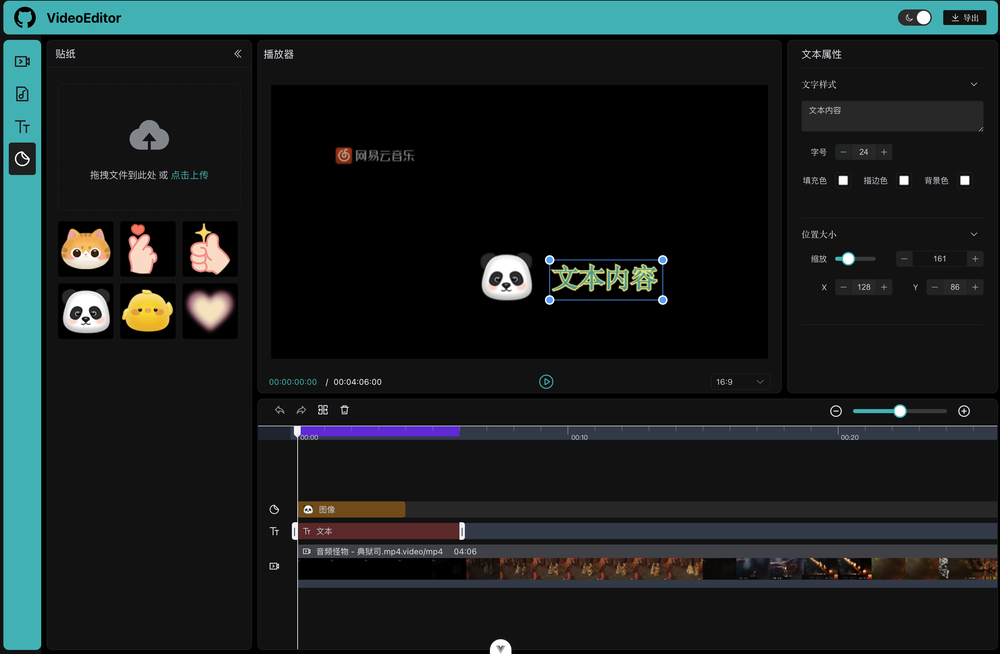

# Video Editor

A pure front-end video editor project based on Vue3 + TypeScript + Element Plus + Unocss, supporting multi-track editing, including video, audio, image and text tracks.

## Preview



## Features

- Developed using Vue 3 and TypeScript, adopting the Composition API.
- Uses Pinia for state management.
- Uses Canvas API for drawing and rendering.
- Uses Web Audio API for audio processing.
- Uses WebAV library (@webav/av-cliper) for video processing and compositing.
- Adopts an object-oriented approach to design track classes (BaseTrack, VideoTrack, AudioTrack, ImageTrack, TextTrack, etc.).
- Uses OffscreenCanvas for off-screen rendering to improve performance.
- Implements responsive player size adjustment.
- Uses Promises and asynchronous functions to handle resource loading and rendering.

## Functionality

- Supports basic editing operations on materials, such as zooming and dragging.
- Provides basic timeline and player functionality.
- Supports multi-track editing and track dragging guide lines.
- Supports compositing and exporting the final video.

## To-Do

- Material selection state, drag optimization, material rotation support
- Audio property editing support
- Undo and redo operation support


## Project Setup

```sh
pnpm install
```

### Compile and Hot-Reload for Development

```sh
pnpm dev
```
